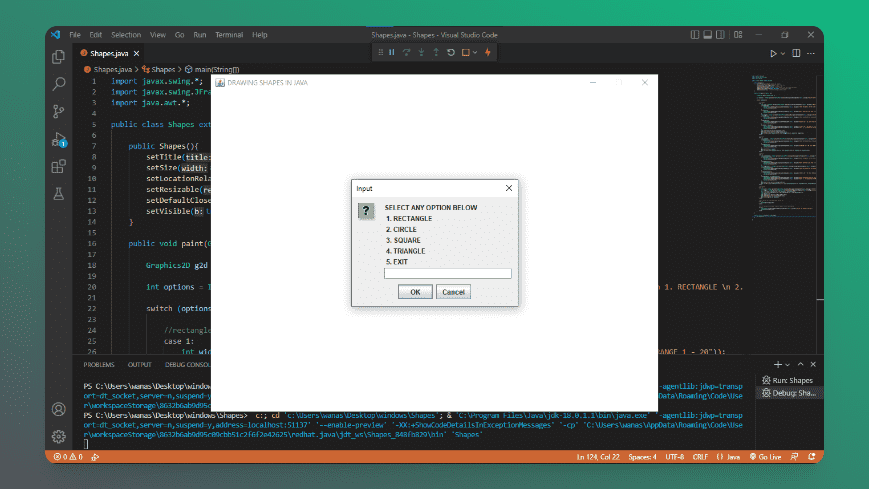

# Shapes
> Java program that displays shape based on user input

### Preview

### Built With
- JAVA

### Software Required
- JDK

### Installation
- Install JDK into your machine.
- Open a text editor of choice (Vs Code).
- Install this extension, "Extenstion Pack for Java".
- Beginning writing Java code.

